# Rapport de recherche sur la classification des panneaux de signalisation

## Pipeline de classification

[alt](#pipeline-de-classification)

## Preparation de l'environnement

### Installation

#### Creation de l'env de travail

Ce mettre dans un dossier de travail et créer le dossier env

```bash
    python -m venv env
```

Activer l'env de travail

- L'activer (Windows)

```bash
.\venv\Scripts\activate
```

- L'activer (Linux/Mac)

```bash
source venv/bin/activate
```

- Installer les dépendances

```bash
    pip install tensorflow keras numpy pandas matplotlib pillow opencv-python scikit-learn tkinter
```

## Glossaire

### CNN

Un CNN traite une image en cascade à travers plusieurs types de couches, chacune jouant un rôle précis.



